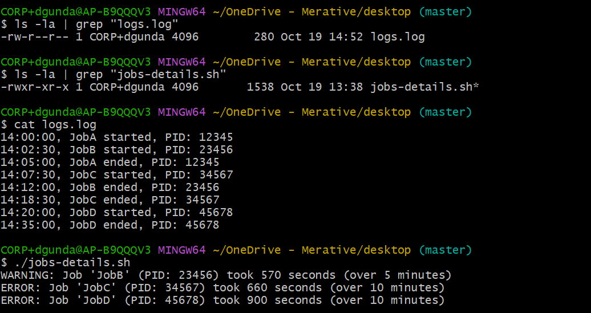

# LSEG-Log Monitoring Application

This is a simple Python-based log monitoring tool that reads a CSV-style log file, tracks job durations, and reports warnings or errors based on how long each job takes to complete.

## File Structure

- `jobs_details.py` — Main Python script that parses and analyzes the log file.
- `logs.log` — Sample log file containing job start and end entries.

## Log Format

Each line in `logs.log` follows this format:
```
HH:MM:SS, JobName started|ended, PID: <number>
```

```
Example:
    14:00:00, JobA started, PID: 12345 
    14:05:00, JobA ended, PID: 12345
```

## Features

- Parses log entries to extract job name, status, timestamp, and PID.
- Tracks start and end times for each job.
- Calculates job duration in seconds.
- Prints:
  - Warning if a job takes more than **5 minutes** (300 seconds).
  - Error if a job takes more than **10 minutes** (600 seconds).

## How to Run

1. Make sure you have Python 3 installed.
2. Place `jobs_details.py` and `logs.log` in the same directory.
3. Run the script:

```
python jobs_details.py
```

## Output Example
```
WARNING: Job 'JobB' (PID: 23456) took 570 seconds (over 5 minutes).
ERROR: Job 'JobC' (PID: 34567) took 660 seconds (over 10 minutes).
```


***Note - We can modify the thresholds as per the use case***

## Additional

Also, attaching the bash script `jobs-details.sh` for acheiving the log monitoring application

